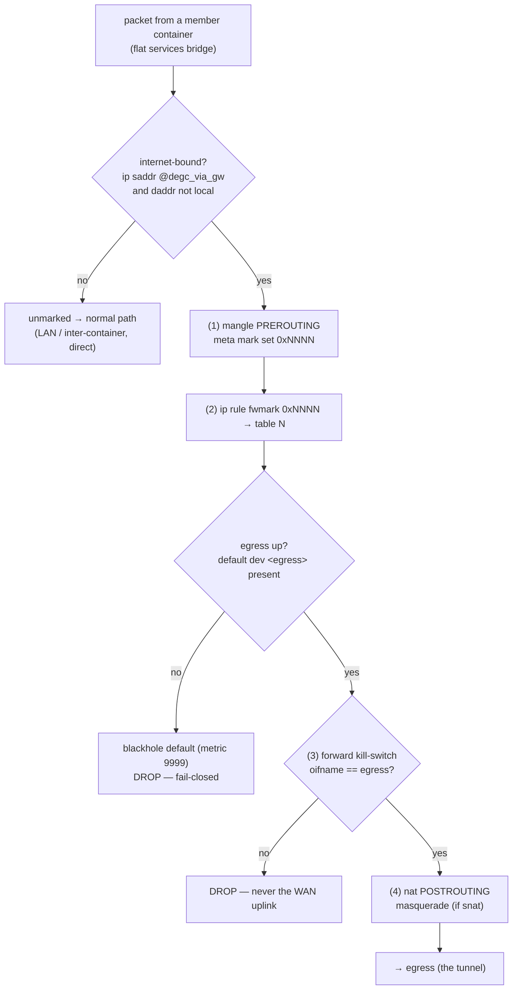

# Architecture

degc is a label-driven **egress policy-router** for a single Docker host.
Container labels declare "route my internet egress out via <gateway>"; degc
enforces that by marking those containers' packets and policy-routing the marked
traffic to a configured **egress** (a host interface or next-hop), with a
fail-closed kill-switch. It is a **host-level daemon** (host netns,
`CAP_NET_ADMIN`, read-only Docker API), not a per-app sidecar.

**degc does not run the VPN.** It never dials WireGuard/OpenVPN, holds no keys
and manages no tunnel — that is the job of an external, pluggable *tunnel
provider* (gluetun, `wg-quick`, systemd-networkd, a minimal WireGuard container
in the host netns, …). degc only does the one thing Docker cannot do natively:
**dynamically route selected containers' egress onto that tunnel**, fail-closed.

degc runs in the host network namespace and owns exactly one nftables table
(`inet degc`) plus its own policy-routing tables, so it composes with other host
nftables controllers (separate tables, separate hooks). For the label convention
— opt-in, `degc.via`, gateway self-declaration and `members` selectors — see
[LABEL-SPEC.md](../LABEL-SPEC.md); this document is how degc works internally.

## Model

A **gateway** in degc is just an **egress target** plus its routing knobs — no
VPN parameters, no secrets:

```yaml
# /etc/degc/gateways.yaml
- name: vpn
  egress:                      # exactly one of the three:
    interface: wg0      #  (a) a host interface — stable
    # container: gluetun       #  (b) a gateway container — RESOLVED to its
    #                          #      current address every reconcile (dynamic-IP
    #                          #      safe); absent at reconcile → fail-closed
    # nextHop: 10.0.0.1        #  (c) a static next-hop IP — only for a real router
  snat: true                   # masquerade onto the egress (needed for a host wg iface)
  mark: 0x4                    # fwmark for this gateway's marked traffic
  table: 200                   # routing table for this gateway
  # destinations that stay DIRECT (never routed to the tunnel): the flat Docker
  # nets + the LAN. Everything else from a member container takes the tunnel.
  localSubnets: ["172.16.0.0/12", "192.168.0.0/16", "10.0.0.0/8"]
```

The egress is brought up **outside degc** by the tunnel provider; degc
treats it as opaque. A **`container`** egress is never a hardcoded IP: degc
re-resolves the gateway container's current address on every reconcile (same
identity model as members below), so a recreate just updates the route, and the
container being down makes the gateway fail-closed (no route installed).

Containers become **members** two ways (label-spec v1alpha1, prefix `degc`);
explicit opt-in always wins:

```yaml
degc.enable: "true"     # (1) per-container opt-in — local, auditable, safest
degc.via: "vpn"         #     gateway name (default: the sole / marked-default one)
```

Or **(2) selector** membership (central), declared on the gateway —
a container matching any selector is routed with no `degc.enable` label:

```yaml
# in gateways.yaml under a gateway (or the degc.gateway.members label):
members:
  - com.docker.compose.service: sabnzbd   # all listed labels must match (AND)
  - vpn: "true"
```

Precedence and safety: an explicit `degc.via` wins over any selector; a
container matched by **two** gateways' selectors with no explicit choice is a
**conflict** — surfaced and **not routed** (degc never guesses an egress). An
empty selector is rejected (it would match everything).

A gateway is either a `gateways.yaml` entry or **self-declared by labels** on
the gateway container — `degc.gateway: "<name>"` plus optional
`degc.gateway.<field>` knobs (`snat`, `mark`, `table`, `localSubnets`,
`default`, `members`) — so no `gateways.yaml` is required. A malformed knob
drops that gateway (fail-closed, surfaced), never mis-routes.

## Identity model

Container IPs change on every recreate, so membership is never static IPs.
degc resolves the opted-in containers **fresh every reconcile** from the
Docker snapshot and populates a named nftables set per gateway
(`degc_via_<gw>`). A stopped container isn't in the next
snapshot, so its address cannot survive into the ruleset — no diffing, no state.

The reload uses `delete table` (not `flush table`): `flush` leaves named-set
elements in place, so a de-opted member — or an IP since reused by a *different*
container — would keep being tunnelled. `delete`+redefine guarantees each set
reflects only the current snapshot.

## Data plane (per packet from a member container)



Only internet-bound traffic is marked; LAN / inter-container traffic stays
direct. The blackhole default sits **below** the egress route (installed before
the fwmark rule), so marked traffic can never fall through to the main table's
WAN default when the egress is down.

**IPv6:** degc routes IPv4 only. An opted-in member's non-local **IPv6** egress
is *dropped* by the kill-switch (`ip6 saddr @degc_via6_<gw> … drop`) — never
routed, never leaked. Full v6 routing is future work.

**Kill-switch responsibility depends on the egress kind:**
- **`interface`** (a host wg device): degc's host nft kill-switch (`meta mark …
  oifname != <iface> drop`) plus the table blackhole are the guard — there is no
  container that could hold one.
- **`container`** (e.g. gluetun): the container owns the *VPN-down* kill-switch
  (run gluetun with `FIREWALL=on` + `FIREWALL_OUTBOUND_SUBNETS` covering the
  members). degc guarantees fail-closed only for *gateway-down / not-yet-routed*
  — the blackhole floor, installed **before** the fwmark rule so marked traffic
  can never fall through to `main` — plus routing correctness. degc adds no
  host oif-drop here (the next hop is a bridge IP, not cleanly oif-matchable).

Unmarked traffic (to `localSubnets`, or from non-members) is untouched and
routed normally — a member stays reachable on the flat network and reaches LAN
peers directly; only its *internet* egress is diverted onto the tunnel.

## Kill-switch correctness (the load-bearing part)

degc's own leak guarantee is fail-closed by **two independent** mechanisms
(the tunnel provider adds its own kill-switch on top — defence in depth):

1. **Routing-level:** table `<gw>` always contains a low-priority
   `blackhole default`, installed before membership. If the egress interface is
   down (its `default dev <egress>` route gone), marked packets hit the blackhole
   and are dropped — they can never fall through to the main table's WAN default.
2. **Netfilter-level:** `meta mark <m> oifname != <egress> drop` drops any marked
   packet that would leave on anything but the egress.

Ordering:
- **Startup fail-closed:** the `inet degc` table (mark + kill-switch) and the
  routing table (with the blackhole) are installed **before** membership is
  populated. Failed initial apply → exit non-zero, never half-open.
- **Reconcile atomic:** only the membership *set* changes between reconciles; the
  kill-switch and blackhole are static, so there is never a window where a
  container is marked but the kill-switch is absent.

Leak test (gate before production): tunnel up → a member's `curl ifconfig.me`
returns the gateway exit IP; egress forced down → it **times out** (never the
home IP); a non-member is unaffected throughout.

## Control plane

Docker API read-only → watch lifecycle events → debounce →
**stateless reconcile** (rebuild each gateway's member IP set from the current
snapshot + gateways config, apply atomically). Periodic resync as a safety net.
All config from the environment: `DEGC_LABEL_PREFIX`, `DEGC_GATEWAYS_PATH`,
`DEGC_RESYNC_INTERVAL`, `DEGC_DEBOUNCE_MS`, plus `--dry-run`.

## Backends

Enforcement is pluggable behind an `Enforcer` trait; both
backends consume the same compiled `Desired`, so `--dry-run` shows byte-for-byte
what `run` applies:

- **logging / `--dry-run`** — renders the resolved host state (the `inet degc`
  ruleset, `ip rule` / routing table) and programs nothing. Validates the whole
  plan without root.
- **system (`nft` + `ip`)** — applies it: the `inet degc` table via `nft -f`
  (one transaction — `add table` / `flush table` / redefine — an atomic replace,
  so a failed reconcile can't leave a half-programmed table), and the `ip rule` /
  routing table / blackhole via `ip`. Needs `CAP_NET_ADMIN` plus `nft` + `ip` in
  the image (nftables + iproute2). Applying the exact rendered ruleset keeps the
  privacy-critical kill-switch auditable. **No WireGuard/OpenVPN backend** — the
  tunnel is external.

A netlink-native backend (`rustables` + `rtnetlink`, no `nft` / `ip` binaries) is
a possible later refinement.

## Coexistence

- **Tunnel provider:** brings up the egress (`wg-*` interface / gateway
  container) independently. degc discovers whether it's up for the kill-switch;
  it never configures it. Recommended egress: a host `wg` interface to the
  router's existing `wg0` (the single VPN hop stays on the router).
- **Docker:** marking is in `mangle PREROUTING` (before Docker's `nat
  POSTROUTING` masquerade); degc's optional SNAT is on `oifname <egress>` only,
  so it never collides with Docker's bridge masquerade. degc owns only
  `inet degc` + its routing table(s).
- **Other nftables controllers:** separate table + hooks; the fwmark is degc's alone.
- **Host prereqs:** `net.ipv4.conf.all.rp_filter=2` (loose) so marked packets may
  be forwarded onto the egress; `net.ipv4.ip_forward=1`.

## Non-goals & open questions

**Non-goals:** running the VPN (dialing WireGuard/OpenVPN, key management, tunnel
kill-switch) — that is the tunnel provider's job; per-app kill-switch isolation
(degc's kill-switch is per-gateway, shared by its members — the desired
behaviour); multi-host / overlay routing.

**Open questions:**
- DNS: the tunnel provider usually pushes VPN DNS; if not, degc could also
  mark+route members' `:53` — needed, or leave to the provider?
- Per-container destination exclusions (a member that wants *some* dest direct)?
- Reaching a `nextHop` gateway *container* cleanly (bridge hairpin + the
  provider's own forwarding rules) vs a host interface — document the tradeoff.
- IPv6 egress (v1 is IPv4-first; model is dual-stack-ready).
